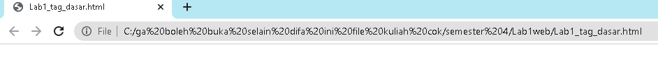
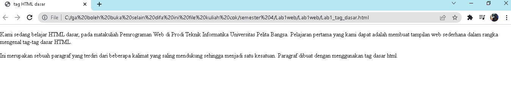

# Lab1web
## tugas pemograman web - pertemuan 2

nama : kurnia difa wijaya  
nim : 312010024  
kelas : TI.20.B.1

**pada pertemuan 2 mata kuliah pemograman web, saya akan melakukan beberapa perintah pada html**

- menampilkan title html pada browser  

 

1.**membuat paragraf**
  
pada poin ini sya akan membuat paragraf pada file html.
pada sintax p bertujuan untuk membuat paragraf baru. berikut tampilannya.  

